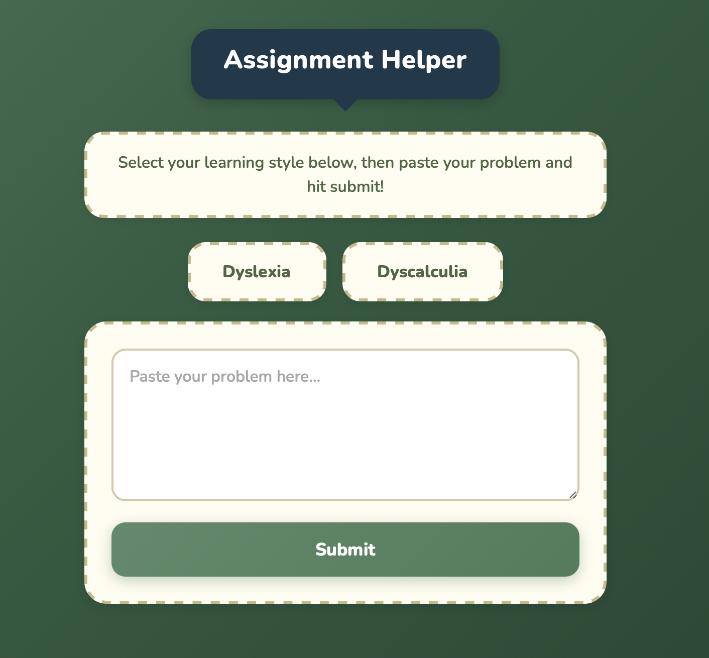

$$\color{red}{
\begin{array}{l}
\text{\Large Nakul's Project Series} \\
\text{\Large - Project One} \\
\text{- Finished: YES} \\
\text{- Start Date: October 14th, 2024} \\
\text{- End Date: November 22nd, 2024} \\
\text{- Reasoning: Created for CS5170: AI in HCI} \\
\text{- Used AI: NO} \\
\text{- Difficulty: Easy} \\
\text{- Comments: Simple GPT wrapper; tried to code without AI.}
\end{array}
}$$

# Dyslexia/Dyscalculia Translator

---

## Table of Contents
1. [Overview](#overview)  
2. [Setup Instructions](#setup-instructions)  
   - [Prerequisites](#prerequisites)  
   - [Installation Steps](#installation-steps)  
3. [Usage](#usage)  
4. [Contributing](#contributing)  
5. [License](#license)  

---

## Overview

The **Dyslexia/Dyscalculia Translator** simplifies complex questions, providing a more accessible and supportive user experience for individuals with dyslexia and dyscalculia. By leveraging OpenAI's API, this project aims to promote inclusivity and equal access to information.

---

## Screenshot

<p align="center">
  
</p>

---

## Setup Instructions

### Prerequisites

Before setting up, ensure the following are installed on your system:
- [Node.js](https://nodejs.org/)  
- [npm](https://www.npmjs.com/)  
- [zsh](https://www.zsh.org/) (optional, for running zsh commands)  

### Installation Steps

1. **Clone the Repository**  
   Clone the project repository to your local machine.

2. **Install Dependencies**  
   Navigate to the `frontend` and `server` directories separately and install the required dependencies:  
   ```bash
   cd frontend
   npm install
   cd ../server
   npm install

3. **Setup OPEN AI Key**
   Add your OpenAI API key to the index.js file located in the server directory.

4. **Install Nodemon Globally**
  Ensure nodemon is installed globally to simplify server management:
   ```bash
    npm install -g nodemon

5. **Start the server**
   Navigate to the server directory and run the server:
   ```bash
    cd server
    nodemon index.js

6. **Start the frontend**
   Navigate to the frontend directory and run the development server:
   ```bash
    cd ../frontend
    npm run dev

## Usage

1. Launch the server and frontend as outlined in the setup instructions.
2. Open the provided link in your browser.
3. Enter questions or statements to be translated into a more understandable format.
4. Interact with the interface to receive simplified text, tailored for individuals with dyslexia and dyscalculia.

---

## License

This project is licensed under the [MIT License](LICENSE).

Feel free to adapt, modify, and use the project in your own applications while adhering to the license terms.
